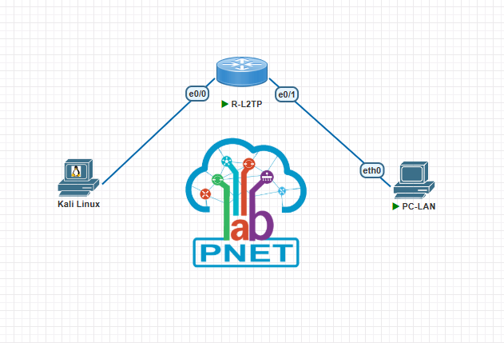
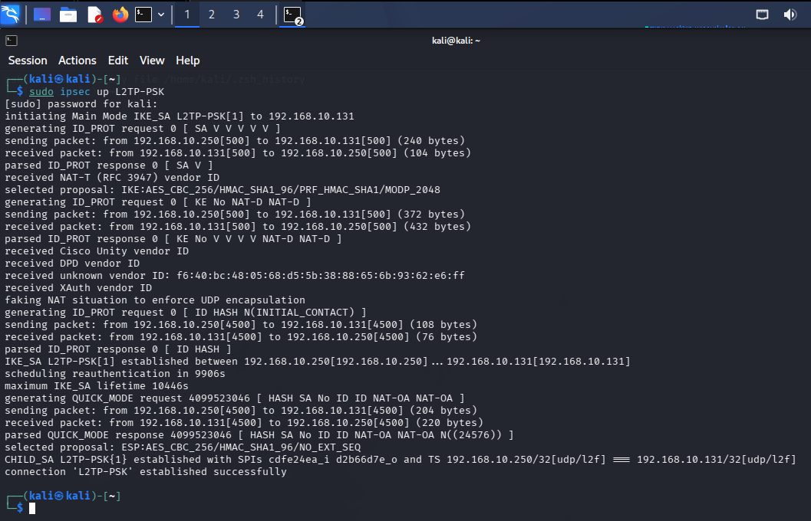
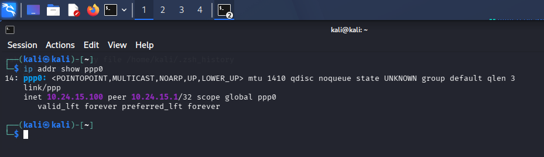
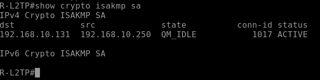
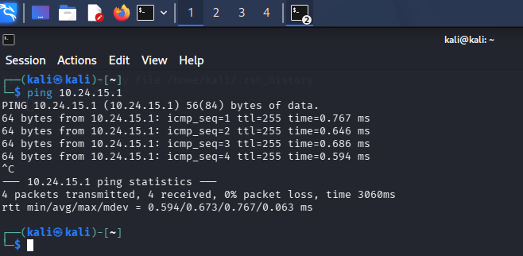
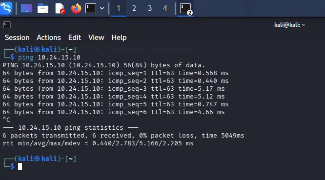

# VPN Client-to-Site L2TP/IPSec IKEv1

**Estudiante:** Edwin De Paula  
**Matricula:** 2024-2415  
**Institución:** Instituto Tecnológico de las Américas (ITLA)  
**Asignatura:** Seguridad en Redes

---

## Video

| Recurso | URL |
|---|---|
| Video YouTube | _pendiente_ |

---

## Objetivo

Implementar una VPN Client-to-Site punto a multipunto utilizando L2TP sobre IPSec con IKEv1, permitiendo que un cliente Linux (Kali Linux) establezca una conexión VPN cifrada hacia un router Cisco actuando como servidor L2TP, obteniendo una dirección IP del pool interno y accediendo a la red LAN del servidor.

---

## Topología



| Dispositivo | Interfaz | Dirección IP | Descripción |
|---|---|---|---|
| R-L2TP | Ethernet0/0 | 192.168.10.131/24 (DHCP) | WAN — Red vmnet8 NAT |
| R-L2TP | Ethernet0/1 | 10.24.15.1/24 | LAN interna |
| R-L2TP | Virtual-Template1 | 10.24.15.1 (unnumbered) | Interfaz virtual L2TP |
| PC-LAN | eth0 | 10.24.15.10/24 | Cliente LAN interno |
| Kali Linux | eth0 | 192.168.10.250/24 | Cliente VPN externo |
| Kali Linux | ppp0 | 10.24.15.100/32 | IP asignada por el pool L2TP |

---

## Parámetros de Configuración

### Fase 1 - IKEv1 (ISAKMP)

| Parámetro | Valor |
|---|---|
| Política | 10 |
| Cifrado | AES 256 |
| Hash | SHA-1 |
| Autenticación | Pre-shared Key |
| Grupo Diffie-Hellman | Grupo 14 (2048 bits) |
| Pre-shared Key | Edwin2024 |

### Fase 2 - IPSec (Transform Set)

| Parámetro | Valor |
|---|---|
| Nombre | TS-2415 |
| Protocolo | ESP |
| Cifrado | AES 256 |
| Integridad | SHA-1 HMAC |
| Modo | Transport |

### L2TP / PPP

| Parámetro | Valor |
|---|---|
| VPDN Group | L2TP-2415 |
| Protocolo | L2TP |
| Virtual Template | 1 |
| Pool de IPs | 10.24.15.100 — 10.24.15.200 |
| Autenticación PPP | CHAP |
| Usuario | Edwin |
| Contraseña | Edwin2024 |

### Cliente Kali Linux (strongSwan + xl2tpd)

| Parámetro | Valor |
|---|---|
| IKE | aes256-sha1-modp2048 |
| ESP | aes256-sha1 |
| PFS | Deshabilitado |
| forceencaps | yes (NAT-T forzado) |
| leftprotoport | 17/1701 |
| rightprotoport | 17/1701 |

---

## Explicación de la Configuración

### ¿Qué es L2TP/IPSec?

L2TP (Layer 2 Tunneling Protocol) es un protocolo de tunelización que opera en la capa 2. Por sí solo no provee cifrado, por lo que se combina con IPSec para asegurar el canal. El flujo es:

1. IPSec establece un canal cifrado entre el cliente y el servidor (Fase 1 y Fase 2)
2. L2TP crea un túnel lógico dentro del canal IPSec
3. PPP negocia la autenticación y asigna una dirección IP al cliente desde el pool

### Diferencia con VPN Site-to-Site

A diferencia de los labs anteriores donde dos routers establecen un túnel entre dos redes, en este lab el cliente es una máquina individual (Kali Linux) que se conecta al servidor L2TP y recibe una IP del pool interno — como si estuviera físicamente en la LAN del servidor.

### Componentes del cliente Linux

- **strongSwan** — maneja la capa IPSec (IKEv1 Fase 1 y Fase 2)
- **xl2tpd** — maneja el túnel L2TP por encima de IPSec
- **pppd** — negocia PPP, autenticación CHAP y asignación de IP

### NAT-T (NAT Traversal)

Como tanto el cliente como el servidor están en una red NAT (VMware vmnet8), se usa `forceencaps=yes` en strongSwan para forzar el encapsulamiento UDP en puerto 4500, permitiendo que IPSec atraviese el NAT correctamente.

### Flujo de Conexión

1. Kali inicia negociación IKEv1 Fase 1 con el router (AES-256, SHA-1, grupo 14)
2. Se establece la SA IKEv1 y se activa NAT-T en puerto 4500
3. Se negocia la SA IPSec en modo Transport para proteger el tráfico L2TP
4. xl2tpd envía la solicitud de conexión L2TP al puerto 1701 del router
5. El router acepta la conexión L2TP y crea una sesión Virtual-Template1
6. PPP negocia CHAP con las credenciales Edwin/Edwin2024
7. El router asigna la IP `10.24.15.100` al cliente desde el pool
8. La interfaz `ppp0` se levanta en Kali con esa IP
9. Se agrega una ruta estática hacia `10.24.15.0/24` por `ppp0`

---

## Verificación

### IPSec establecido — Kali

```
sudo ipsec up L2TP-PSK
```



La línea `connection 'L2TP-PSK' established successfully` confirma que la Fase 1 y Fase 2 de IPSec se completaron. El CHILD_SA muestra los traffic selectors UDP/1701 activos.

### Interfaz ppp0 — Kali

```
ip addr show ppp0
```



La interfaz `ppp0` activa con IP `10.24.15.100` confirma que el túnel L2TP y la negociación PPP se completaron exitosamente. El router asignó la IP del pool configurado.

### ISAKMP SA — Router

```
show crypto isakmp sa
```



Estado `QM_IDLE / ACTIVE` confirma que la SA IKEv1 está establecida entre el cliente Kali y el servidor L2TP.

### Ping al Router (gateway del túnel)

```
ping 10.24.15.1
```



100% de success rate hacia la IP interna del router confirma conectividad a través del túnel L2TP/IPSec.

### Ping a PC-LAN (host interno)

```
ping 10.24.15.10
```



100% de success rate hacia la PC-LAN confirma que el cliente VPN puede acceder a recursos internos de la red, como si estuviera físicamente conectado a la LAN del servidor.

---

## Archivos del Repositorio

```
l2tp-ipsec-ikev1/
├── configs/
│   ├── R-L2TP.txt
│   ├── ipsec.conf
│   ├── ipsec.secrets
│   ├── xl2tpd.conf
│   └── options.l2tpd.client
├── docs/
│   └── screenshots/
│       ├── topology.png
│       ├── ipsec-up.png
│       ├── ppp0.png
│       ├── isakmp-sa.png
│       ├── ping-router.png
│       └── ping-lan.png
└── README.md
```

---

## Herramientas Utilizadas

- PNetLab — Plataforma de emulación de red
- Cisco IOSv 15.4(2)T4 — Servidor L2TP/IPSec
- Kali Linux — Cliente VPN (strongSwan 6.0.7 + xl2tpd 1.3.20)
- VMware Workstation — Virtualización
